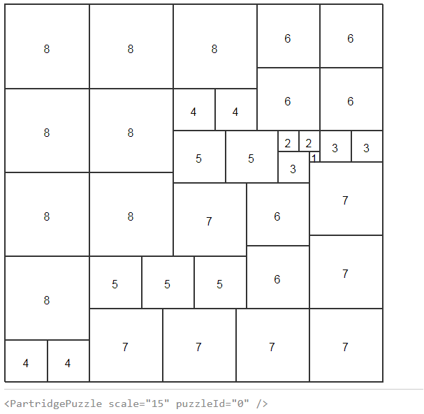
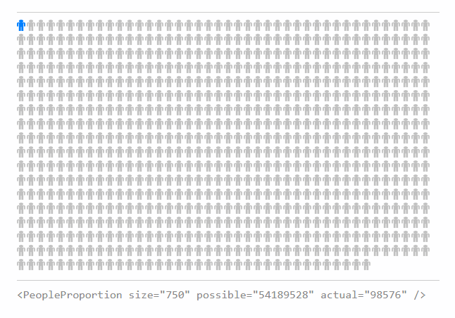

# react-components

These are my custom React components. This project was bootstrapped with [Create React App](https://github.com/facebookincubator/create-react-app).

## PartridgePuzzle

Render a particular [Partridge Puzzle](http://www.mathpuzzle.com/partridge.html). The one shown below is taken from Donald Knuth's Art of Computer Programming (figure 62). The data is currently hard-coded into the component source, but it could be drawn from a database of all possible squares, of which there are thousands (for 36x36 squares).

I'm brainstorming a Battleship-style game where you have to uncover your opponent's full square in fewer turns than they uncover yours, using a certain number of available probes and using deduction smartly.

## PeopleProportion

Visualize a percentage of people in a group. Do you get a ton of retweets or likes? Visualize the proportion of your total follower count that retweets/likes your tweets, in order to get a more accurate perspective of engagement levels.

