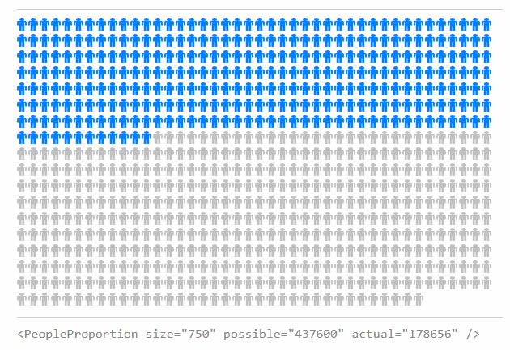

# react-components

These are my custom React components. This project was bootstrapped with [Create React App](https://github.com/facebookincubator/create-react-app).

## PeopleProportion

Visualize a percentage of people in a group. Do you get a ton of retweets? Visualize the proportion of your total follower count that retweets you, in order to get a more accurate perspective of engagement levels.

